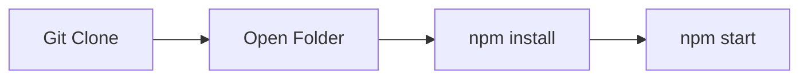

[](https://awesome.re)


<p align="center">
  <a href="downedmarkdown.vercel.app">
    
  </a>

</p>
<h1 align="center" >DOWNED - README MARKDOWN PREVIEWER </h1>

  
</p>

This GitHub repository serves as a platform for the GDSC SRM recruitment process, offering a preview of the front-end markdown.
<br>

## Setting Up Downed

1. Installing Dependencies:
    ```bash
       npm install

2. Starting the Server:
    ```bash
      npm start
<br>

<p>Running website on Local Host</p>



<div><h2><strong>Developer of this project 🔻</strong></h2></div>

<table align="center">
<tr align="center">
<td>

**ADITYA VERMA**

<p align="center">

</p>
<p align="center">
<a href = "https://github.com/ADITYAVOFFICIAL"></a>
<a href = "https://www.linkedin.com/in/aditya-verma-real/">

</a>
<a href = "https://medium.com/@adityaver">

</a>
</p>
</td>
</table>

 ## Current Contributors 🔻
<div align="center">
  <a href="https://github.com/ADITYAVOFFICIAL/GDSC_Front/graphs/contributors">
  
</a>
</div>
